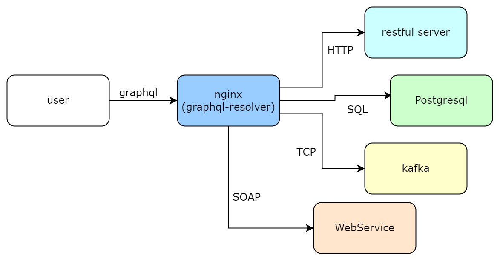
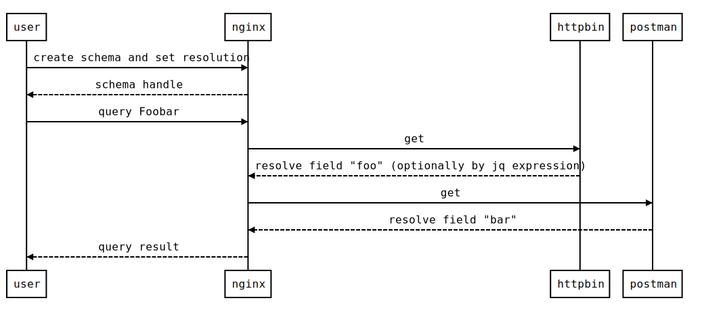

# lua-resty-ffi-graphql-resolver

The openresty graphql server library that encapsulates [ariadne](https://ariadnegraphql.org/).



**Callflow example:**



**Highlights:**

* supports multiple data sources
  * [x] RESTful
  * [ ] PostgreSQL
  * [ ] Kafka
  * [ ] WebService
  * any other datasources to be implemented...
* fully asynchronous
* multiple schema instances
* fully dynamic
  * create and delete schema
  * dynamic resolver mapping
* [jq](https://jqlang.github.io/jq/) expression to transform response body
* zero code

## Background

GraphQL is popular. Can we embed graphql server into openresty? In this way,
we can not only enjoy the benefits brought by nginx high-performance proxy,
but also request multiple different upstreams to generate the response content of graphql query
without independent graphql server.

[Ariadne](https://github.com/mirumee/ariadne) is a brilliant python graphql server, which is schema-first and has simple but powerful APIs.

Why not encapsulate it so that we could reuse it in openresty?

[lua-resty-ffi](https://github.com/kingluo/lua-resty-ffi) provides an efficient and generic API to do hybrid programming
in openresty with mainstream languages (Go, Python, Java, Rust, Nodejs).

**lua-resty-ffi-graphql-resolver = lua-resty-ffi + ariadne**

## Synopsis

**Schema Config:**

* schema: graphql schema text
* datasources
  * `<name>` (fields other than @type is datasource specifc configuration fields)
    * @type: datasource type: http|sql|webservice|kafka
    * host: host name, including scheme, for http type only.
    * verify: verify ssl server name or not, optional, for http type only.
* resolvers
  * `<GraphQL Type Name>`
    * `<type field name>` (fields other than datasource is datasource specifc configuration fields)
      * datasource: reference name
      * uri: uri path, for http type only.
      * headers: request headers, optional, for http type only.
      * method: request method, optional, for http type only.
      * send_json_body: send graphql params in json body, or in uri arguemnts, optional, for http type only.
      * jq: jq expression to transform the response body for custom graphql output, optional, for http type only.

```lua
local schema, err = graphql_resolver.new({
    schema = "<graphql scehma text>",
    datasources = {
        nghttp2 = {
            ["@type"] = "http",
            host = "https://nghttp2.org",
            verify = true
        },
    },
    resolvers = {
        Query = {
            get = {
                datasource = "nghttp2",
                uri = "/httpbin/get",
                headers = {
                    foo = "xxx",
                    bar = "yyy"
                },
                method = "post",
                send_json_body = true,
                jq = "{url,agent:.headers.\"user-agent\"}"
            }
        }
    }
})
```

**Query:**

* query: graphql query, mutation or subscription
* variables: variables used in the query, optional

```lua
local ok, res, err = schema:query({
    query = "<graphql query string>",
    variables = {
        foo = "bar"
    }
})
```

**Query Result:**

Returns a tuple with two items:
* bool: True when no errors occurred, False otherwise.
* dict: an JSON-serializable dict with query result (defining either data, error, or both keys) that should be returned to client.

```lua
{ true, {
    data = {
      get = {
        origin = "192.168.1.1",
        uuid = "9fe7a61f-8c61-4299-b4a6-666788954b70-suffix"
      }
    }
  } }
```

## Demo

### Setup lua-resty-ffi-graphql-resolver

```bash
# install lua-resty-ffi
# https://github.com/kingluo/lua-resty-ffi#install-lua-resty-ffi-via-luarocks
# set `OR_SRC` to your openresty source path
luarocks config variables.OR_SRC /tmp/tmp.Z2UhJbO1Si/openresty-1.21.4.1
luarocks install lua-resty-ffi

# make lua-resty-ffi python loader library
apt install python3-dev python3-pip libffi-dev
cd /opt
git clone https://github.com/kingluo/lua-resty-ffi
cd /opt/lua-resty-ffi/examples/python
make

# install deps
cd /opt
git clone https://github.com/kingluo/lua-resty-ffi-graphql-resolver
cd /opt/lua-resty-ffi-graphql-resolver
pip3 install -r requirements.txt

# run nginx
cd /opt/lua-resty-ffi-graphql-resolver/demo
PATH=/opt/resty_ffi/nginx/sbin/:$PATH \
LD_LIBRARY_PATH=/opt/lua-resty-ffi/examples/python:/usr/local/lib/lua/5.1 \
PYTHONPATH=/opt/lua-resty-ffi-graphql-resolver \
nginx -p $PWD -c nginx.conf
```

### Create schema

```bash
curl http://localhost:20000/create_schema -X POST -d '
{
    "schema": "type Get{origin:String!uuid:String}type Query{get:Get}type Post{url:String!agent:String!}type Mutation{post(data:String!):Post}",
    "datasources": {
        "nghttp2": {
            "@type": "http",
            "host": "https://nghttp2.org",
            "verify": true
        },
        "postman": {
            "@type": "http",
            "host": "https://postman-echo.com"
        }
    },
    "resolvers": {
        "Query": {
            "get": {
                "datasource": "nghttp2",
                "uri": "/httpbin/get",
                "headers": {
                    "foo": "xxx",
                    "bar": "yyy"
                }
            }
        },
        "Get": {
            "uuid": {
                "datasource": "nghttp2",
                "uri": "/httpbin/uuid",
                "jq": ".uuid + \"-suffix\""
            }
        },
        "Mutation": {
            "post": {
                "datasource": "postman",
                "uri": "/post",
                "method": "post",
                "send_json_body": true,
                "jq": "{url,agent:.headers.\"user-agent\"}"
            }
        }
    }
}' -s | jq
```

ouput:

```json
{
  "schema": 1
}
```

### Query

```bash
curl http://localhost:20000/query?schema=1 -X POST -d '
{
    "query": "query Test{get{origin uuid}}"
}' -s | jq
```

output:

```json
[
  true,
  {
    "data": {
      "get": {
        "uuid": "95dbdfd0-1fcb-4428-8567-3ed0bea9aa7e-suffix",
        "origin": "192.168.1.1"
      }
    }
  }
]
```

### Mutation

```bash
curl http://localhost:20000/query?schema=1 -X POST -d '
{
    "query": "mutation Test($data:String!){post(data:$data){url agent}}",
    "variables": {
        "data": "foobar"
    }
}' -s | jq
```

output:

```json
[
  true,
  {
    "data": {
      "post": {
        "agent": "python-httpx/0.23.1",
        "url": "https://postman-echo.com/post"
      }
    }
  }
]
```

### Close schema

```bash
curl http://localhost:20000/close_schema?schema=1
```
